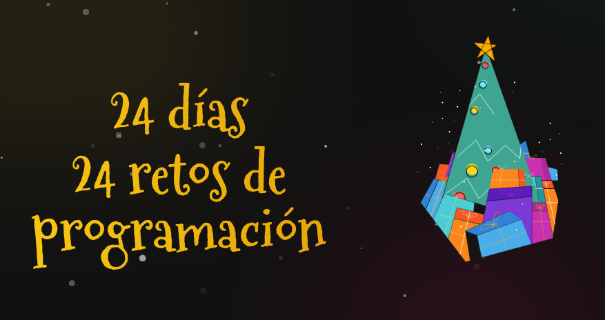

## AdventJs edición 2022

  

24 retos con javascript de la iniciativa [adventjs](https://adventjs.dev) propuesto por el desarrollador **Miguel Ángel Durán**

**Dificultad:** 🟢 Fácil 🟠 Normal 🔴 Difícil 🟣 Muy Difícil

|  #  |                     challenge                     | difficulty |                   description                   |               solution               |
| :-: | :-----------------------------------------------: | :--------: | :---------------------------------------------: | :----------------------------------: |
|  1  |    ¡Automatizando envolver regalos de navidad!    |     🟢     | [show](https://adventjs.dev/challenges/2022/1)  | [code](2022/challenges/01/README.md) |
|  2  |          Nadie quiere hacer horas extra           |     🟢     | [show](https://adventjs.dev/challenges/2022/2)  | [code](2022/challenges/02/README.md) |
|  3  | ¿Cuántas cajas de regalos puede llevar Papá Noel? |     🟢     | [show](https://adventjs.dev/challenges/2022/3)  | [code](2022/challenges/03/README.md) |
|  4  |      Una caja dentro de otra caja y otra...       |     🟠     | [show](https://adventjs.dev/challenges/2022/4)  | [code](2022/challenges/04/README.md) |
|  5  |                                                   |            | [show](https://adventjs.dev/challenges/2022/5)  |                                      |
|  6  |                                                   |            | [show](https://adventjs.dev/challenges/2022/6)  |                                      |
|  7  |                                                   |            | [show](https://adventjs.dev/challenges/2022/7)  |                                      |
|  8  |                                                   |            | [show](https://adventjs.dev/challenges/2022/8)  |                                      |
|  9  |                                                   |            | [show](https://adventjs.dev/challenges/2022/9)  |                                      |
| 10  |                                                   |            | [show](https://adventjs.dev/challenges/2022/10) |                                      |
| 11  |                                                   |            | [show](https://adventjs.dev/challenges/2022/11) |                                      |
| 12  |                                                   |            | [show](https://adventjs.dev/challenges/2022/12) |                                      |
| 13  |                                                   |            | [show](https://adventjs.dev/challenges/2022/13) |                                      |
| 14  |                                                   |            | [show](https://adventjs.dev/challenges/2022/14) |                                      |
| 15  |                                                   |            | [show](https://adventjs.dev/challenges/2022/15) |                                      |
| 16  |                                                   |            | [show](https://adventjs.dev/challenges/2022/16) |                                      |
| 17  |                                                   |            | [show](https://adventjs.dev/challenges/2022/17) |                                      |
| 18  |                                                   |            | [show](https://adventjs.dev/challenges/2022/18) |                                      |
| 19  |                                                   |            | [show](https://adventjs.dev/challenges/2022/19) |                                      |
| 20  |                                                   |            | [show](https://adventjs.dev/challenges/2022/20) |                                      |
| 21  |                                                   |            | [show](https://adventjs.dev/challenges/2022/21) |                                      |
| 22  |                                                   |            | [show](https://adventjs.dev/challenges/2022/22) |                                      |
| 23  |                                                   |            | [show](https://adventjs.dev/challenges/2022/23) |                                      |
| 24  |                                                   |            | [show](https://adventjs.dev/challenges/2022/24) |                                      |
